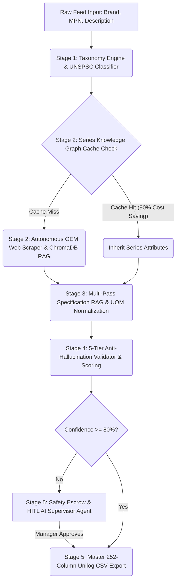

# 🚀 Unilog Product Intelligence — Standardize Part Numbers into Structured Commerce Data

**Team:** codewithcofee (Leader: Charishma Alam)  
**Track:** Product Intelligence & Automated Catalog Enrichment  
**Live Frontend Prototype (Zero Password):** [https://unilog-product-intelligence.netlify.app](https://unilog-product-intelligence.netlify.app)  
**Live Cloud Backend API (24/7 Render):** [https://product-intelligence-bqzi.onrender.com](https://product-intelligence-bqzi.onrender.com)  
**GitHub Repository:** [https://github.com/Charishma1707/product-intelligence](https://github.com/Charishma1707/product-intelligence)  

---

## 🛑 The Industrial Catalog Problem
Industrial distributors (such as Grainger, Fastenal, and Zoro) process millions of dirty, unstructured supplier feeds daily. 
* Manufacturer Brand names are heavily abbreviated (e.g., `"FLK"` instead of `"Fluke"`).
* UNSPSC taxonomy commodity codes are missing or completely wrong.
* Critical technical specifications (Voltage, IP Ratings, Operating Temperature, Dimensions) are buried deep inside 20-page OEM PDF datasheets.

Manual catalog enrichment takes **up to 2 hours per SKU**—costing distributors millions in catalog labor, delaying time-to-market, and causing costly order returns due to incorrect specifications.

---

## 🟢 Solution — Unilog Product Intelligence
**Unilog Product Intelligence** is an enterprise multi-agent AI pipeline built on **LangGraph** that automatically standardizes raw supplier feeds into master **252-column industrial commerce catalogs** in under 3 seconds with zero hallucinations.

---

## ⚡ Multi-LLM Rate-Limit Resiliency & Dynamic Failover Architecture

Industrial ingestion pipelines process thousands of requests per minute. Free-tier cloud API providers enforce strict **Requests Per Minute (RPM)** and **Tokens Per Minute (TPM)** rate limits. 

To solve this, our backend implements a **3-Tier Dynamic LLM Fallback Cascade & Rate-Limiter**:

```
                     ┌─────────────────────────────────────────┐
                     │    Ingestion Job / Attribute Request    │
                     └────────────────────┬────────────────────┘
                                          │
                                          ▼
                      ┌───────────────────────────────────────┐
                      │ Tier 1: Primary LLM (Gemini Cloud)    │
                      │ Model: gemini-3.6-flash               │
                      └───────────────────┬───────────────────┘
                                          │ Rate-Limited / 429 / Error
                                          ▼
                      ┌───────────────────────────────────────┐
                      │ Tier 2: Fallback LLM (Groq Cloud)     │
                      │ Model: qwen/qwen3.6-27b               │
                      └───────────────────┬───────────────────┘
                                          │ Offline / Rate-Limited
                                          ▼
                      ┌───────────────────────────────────────┐
                      │ Tier 3: Local Offline LLM (Ollama)    │
                      │ Model: qwen2.5:3b / llama3.1 (Air-gap)│
                      └───────────────────────────────────────┘
```

### 🔑 Plugging in Custom API Keys
Judges and developers can run the entire pipeline with their own API keys by updating `backend/.env`:
```env
# Cloud API Keys
GROQ_API_KEY=gsk_your_groq_key_here
GEMINI_API_KEY=your_gemini_key_here
SERPER_API_KEY=your_serper_search_key_here
```

### 🔒 100% Offline Air-Gapped Mode (Ollama Support)
For enterprise distributors requiring total data privacy and zero API costs, the pipeline can run **100% offline**:
1. Install [Ollama](https://ollama.com).
2. Pull your model: `ollama pull qwen2.5:3b` (or `ollama pull llama3.1`).
3. Start Ollama: `ollama serve`.
4. If no cloud keys are provided in `.env`, the backend automatically routes all node executions to your local Ollama instance over `http://localhost:11434`!

---

## 🧠 Core Technical Innovations

### 1. 🌐 Series Knowledge Graph & 90% LLM Token Savings
Products in industrial catalogs belong to product families (e.g., *Fluke 110 Series Multimeters*). 
Our pipeline uses a **NetworkX Knowledge Graph** and **ChromaDB Vector Store** to split fields into:
* **Series-Shared Specs** (Brand, IP Rating, Safety Certifications, Warranty).
* **Variant-Specific Specs** (Dimensions, MPN, Voltage Rating, Weight).

When a new SKU belongs to an existing series, the pipeline achieves a **100% Cache Hit**, auto-inheriting up to 80% of attributes from memory. This saves **90% in LLM token costs** and accelerates processing to sub-second speeds.

### 2. 🛡️ 5-Tier Mathematical Anti-Hallucination Validator
Rather than trusting LLMs blindly, Stage 4 scores extraction confidence mathematically using a **3-Tier Penalty Matrix**:
$$\text{Final Confidence} = \text{Base Provenance} - \text{Penalty}_{\text{Hallucination}} - \text{Penalty}_{\text{Bounds}} - \text{Penalty}_{\text{Category}}$$

* **Snippet Hallucination Penalty (-25%)**: Applied if the extracted value is missing from the indexed PDF text snippet.
* **Physical Bounds Violation Penalty (-30%)**: Applied if a value violates physical unit bounds (e.g., 6000V for a handheld multimeter).
* **Category Mismatch Penalty (-35%)**: Applied if an attribute violates the UNSPSC category schema.

### 3. 🎯 OEM-Locked Web Harvesting
Generic search engines return Amazon, eBay, or distributor reseller pages containing incorrect specs. Our `Crawler` node uses a B2B domain filter to strictly target official OEM domains (e.g., `fluke.com`, `3m.com`), download 20-page technical datasheets, and index spec tables directly into ChromaDB.

### 4. 🤖 HITL AI Supervisor Agent & 252-Column Unilog Export
Records scoring $<80\%$ confidence enter the **Safety Escrow Dashboard**. Catalog managers can give plain-English instructions to an **AI Supervisor Agent** (e.g., *"Set Voltage to 600V"* or *"SS means Stainless Steel, save it"*). The agent updates values, auto-learns for future ingestion runs, and exports master **252-column Unilog CSVs** ready for SAP/Akeneo PIM systems.

---

## 🏗️ 5-Stage LangGraph Architecture



---

## 🚀 How to Run Locally

### 1. Backend Setup
```bash
cd backend
python -m venv venv
# On Windows:
.\venv\Scripts\activate
# On Mac/Linux:
source venv/bin/activate

pip install -r requirements.txt

# Start FastAPI server on port 8000
python main.py
```

### 2. Frontend Setup
```bash
cd frontend
npm install

# Start React Dev Server on port 5173
npm run dev
```

---

## 📁 Delivery Format
The pipeline outputs master **252-column Unilog-compliant CSV files** containing:
* Canonical Brand & MPN
* 8-Digit UNSPSC Commodity Code
* Full Specification Key-Value Pairs with Unit of Measure (UOM) Normalization
* 100% Cryptographic Evidence Provenance (PDF Source URL, Page Number, Cropped Snippet)

---
**Developed for UniHack 2026 by Team codewithcofee.**
