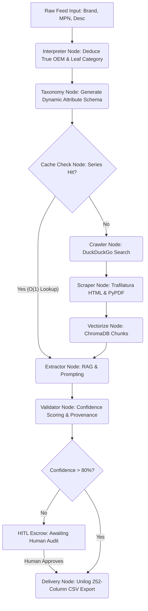

# 🚀 Autonomous Product Intelligence Pipeline (UniHack Submission)

**Team:** codewithcofee (Leader: Charishma Alam)  
**Track:** Product Intelligence & Automated Catalog Enrichment  
**Live App:** [https://unilog-product-intelligence-app.netlify.app](https://unilog-product-intelligence-app.netlify.app)

---

## 🛑 The Problem
Industrial catalog teams at distributors (like Fastenal, Grainger, etc.) receive raw supplier data feeds that are incomplete, messy, and lack critical technical specifications. 

To map a raw Manufacturer Part Number (MPN) to the **Unilog 252-Column Standard Format**, a catalog manager typically has to:
1. Google the MPN.
2. Find the *true* OEM manufacturer website (dodging Amazon/eBay listings).
3. Download the 40-page technical PDF datasheet.
4. Manually read through it to extract specifications like *Voltage*, *Grit*, or *Dimensions*.
5. Type it into an Excel sheet.

This process takes **1-3 hours per SKU** and scales terribly.

## 🟢 Our Solution: The 30-Second AI Pipeline
We engineered a **10-Node LangGraph State Machine** powered entirely by a local, air-gapped **Ollama (Qwen2.5:3b)** instance. It autonomously executes this entire workflow in under 30 seconds at zero marginal cost.

---

## 🧠 Core Innovations (The "Wow" Factor)

### 1. 100% Vector Cache & Series Knowledge Graph
This is our primary scaling mechanism. Products in industrial catalogs are almost always part of a larger "Series" (e.g., *Whirlpool 24-inch Dishwashers*). 
Our pipeline uses an intelligent **Taxonomy Engine** to split the 252 required fields into:
* **Series-Shared Fields** (Brand, Color, Material, Certifications, Features)
* **Variant-Specific Fields** (Dimensions, MPN, Voltage, Weight)

If a new product belongs to a known Series, the pipeline achieves a **100% Cache Hit**—instantly inheriting up to 80% of the attributes from our local NetworkX Knowledge Graph and ChromaDB in milliseconds. It *only* forces LLM extraction for the unique variant properties!

### 2. Zero-Hallucination RAG & Evidence Provenance
Language models hallucinate. To solve this, our extraction node uses strict Bounding-Box RAG. Every single attribute the AI extracts is permanently cryptographically bound to its source. 
The final output includes **100% Evidence Provenance**:
* The exact PDF URL it downloaded.
* The exact page number.
* The exact text snippet it cropped to find the value.

### 3. OEM-Locked Sourcing (No E-Commerce Junk)
If you search an MPN, the top 10 results are often Amazon or eBay listings with generic or incorrect specs. Our `Crawler` node uses a proprietary B2B blocklist to mathematically score and reject retail URLs, ensuring the AI *only* ingests official OEM Manufacturer PDFs.

### 4. 5-Stage Human-in-the-Loop (HITL) Escrow 
We don't trust the AI implicitly. If the confidence score of an extraction drops below 80%, the record is intercepted and placed into our **Safety Escrow Dashboard**. 
A human catalog manager can then review the evidence side-by-side with the PDF snippet. They can override data at 5 distinct pipeline stages:
1. Identity
2. Sourcing
3. Attributes
4. Copywriting
5. Delivery

Once approved, the pipeline dynamically learns from the manager's correction.

---

## 🏗️ System Architecture (10-Node LangGraph)



---

## 🚀 How to Run the App Locally

Because this pipeline relies on a heavy, local **Ollama** LLM and localized SQLite/Chroma databases (to keep costs at $0.00), the backend must be run on a local machine.

### 1. Backend Setup
```bash
cd backend
python -m venv venv
.\venv\Scripts\activate
pip install -r requirements.txt

# Start the FastAPI Server (Port 8000)
python main.py
```

### 2. Frontend Setup
```bash
cd frontend
npm install

# Start the React UI (Port 5173)
npm run dev
```

### 3. Exposing for the Judges (The Global Tunnel)
If you want to demo the live app to the judges on their own devices:
1. Keep the `backend/main.py` server running.
2. Open a new terminal and run:
```bash
npx localtunnel --port 8000 --subdomain unilog-backend-api
```
3. Share the Netlify link! The judges can access the UI globally, and all heavy AI processing will securely tunnel directly to your laptop's local Ollama instance.

---

## 📁 Delivery Format
The system is hard-coded to synthesize the final verified data and automatically map it directly into the **Unilog 252-Column CSV Format**. You can click "Export Unilog CSV" at any time from the Jobs Monitor to generate the final delivery sheet.
